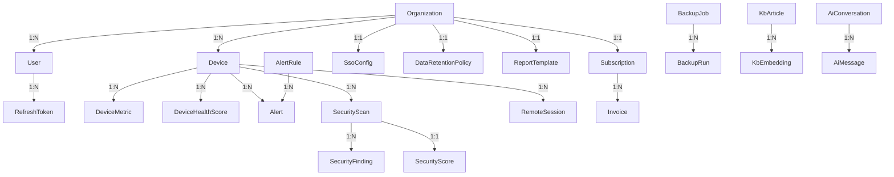

# AH-1C — Database Discovery

> **Status:** Discovery only. No code changes, migrations, or data modifications.

---

## Database Overview

| Property | Value |
|----------|-------|
| Engine | PostgreSQL |
| Extensions | TimescaleDB (for `DeviceMetric` hypertable) |
| ORM | Prisma (`prisma-client-js` generator) |
| Schema file | `apps/api-gateway/prisma/schema.prisma` (745 lines) |
| Models | 34 |
| Enums | 3 |
| Migrations | 8 (sequential) |
| RLS | Row-Level Security on all tenant-scoped tables |
| Tenant isolation | Session variable `app.current_org_id` + per-table RLS policies |

**PrismaService** (`src/prisma/prisma.service.ts:5`) extends `PrismaClient` with lifecycle hooks. Wrapped by a global `PrismaModule` (`src/prisma/prisma.module.ts:6`).

---

## Enum and Model Map

### Enums

| Enum | Values | Defined in schema |
|------|--------|-------------------|
| `Role` | `Owner`, `Admin`, `Technician`, `Viewer` | `schema.prisma:10` |
| `Plan` | `Free`, `Pro`, `Business`, `Enterprise` | `schema.prisma:17` |
| `SubscriptionStatus` | `Active`, `PastDue`, `Canceled`, `Incomplete`, `IncompleteExpired`, `Trialing`, `Unpaid`, `Paused` | `schema.prisma:24` |

### Models (34 total)

| # | Model | Tenant-scoped | orgId | Global catalog | Backend used |
|---|-------|:---:|:---:|:---:|:---:|
| 1 | Organization | root | — | — | Yes |
| 2 | User | Yes | ✓ | — | Yes |
| 3 | RefreshToken | Yes | ✓ | — | Yes |
| 4 | Device | Yes | ✓ | — | Yes |
| 5 | DeviceMetric | Yes | ✓ | — | Yes |
| 6 | DeviceHealthScore | Yes | ✓ | — | Yes |
| 7 | AlertRule | Yes | ✓ | — | Yes |
| 8 | Alert | Yes | ✓ | — | Yes |
| 9 | AiProviderConfig | Yes | ✓ | — | Yes |
| 10 | AiUsageLog | Yes | ✓ | — | Yes |
| 11 | AiConversation | Yes | ✓ | — | **No** |
| 12 | AiMessage | **No** | **No** | — | **No** |
| 13 | SecurityScan | Yes | ✓ | — | Yes |
| 14 | SecurityFinding | Yes | ✓ | — | Yes |
| 15 | SecurityScore | Yes | ✓ | — | Yes |
| 16 | NetworkDevice | Yes | ✓ | — | Yes |
| 17 | NetworkScan | Yes | ✓ | — | Yes |
| 18 | DriverCatalogItem | — | **No** | ✓ | Yes |
| 19 | Driver | Yes | ✓ | — | Yes |
| 20 | SoftwareCatalogItem | — | **No** | ✓ | **No** |
| 21 | SoftwareInventory | Yes | ✓ | — | Yes |
| 22 | BackupJob | Yes | ✓ | — | Yes |
| 23 | BackupRun | Yes | ✓ | — | Yes |
| 24 | Subscription | Yes | ✓ | — | Yes |
| 25 | Invoice | Yes | ✓ | — | Yes |
| 26 | ReportTemplate | Yes | ✓ | — | Yes |
| 27 | Report | Yes | ✓ | — | Yes |
| 28 | ReportSchedule | Yes | ✓ | — | Yes |
| 29 | RemoteSession | Yes | ✓ | — | Yes |
| 30 | SsoConfig | Yes | ✓ | — | Yes |
| 31 | DataRetentionPolicy | Yes | ✓ | — | Yes |
| 32 | AuditLog | Yes | ✓ | — | Yes |
| 33 | KbArticle | Yes | ✓ | — | Yes |
| 34 | KbEmbedding | **No** | **No** | — | Yes |

**Summary:** 31 tenant-scoped models, 2 global catalog models, 1 dependent child (AiMessage). 31 of 34 models are referenced by backend services.

---

## Organization Ownership Model



**Delete behavior summary:**

| Parent | Child | FK Action |
|--------|-------|-----------|
| Organization | User | RESTRICT |
| Organization | Device | RESTRICT |
| Organization | Subscription | CASCADE |
| Organization | SsoConfig | CASCADE |
| Organization | DataRetentionPolicy | CASCADE |
| User | RefreshToken | CASCADE |
| Device | DeviceMetric | CASCADE |
| Device | DeviceHealthScore | CASCADE |
| AlertRule | Alert | CASCADE |
| Alert | Device | CASCADE |
| SecurityScan | SecurityFinding | CASCADE |
| SecurityScan | SecurityScore | CASCADE |
| Subscription | Invoice | CASCADE |
| BackupJob | BackupRun | CASCADE |
| KbArticle | KbEmbedding | CASCADE |
| AiConversation | AiMessage | CASCADE |

**Critical observation:** `Organization → User` and `Organization → Device` use `RESTRICT`, preventing accidental org deletion. All child data tables use `CASCADE`.

---

## Relationship Map

### Unique Constraints

| Table | Constraint | File Reference |
|-------|-----------|----------------|
| Organization | `slug` | `schema.prisma:38` |
| Organization | `stripeCustomerId` | `schema.prisma:40` |
| User | `email` | `schema.prisma:75` |
| User | `(orgId, email)` | `schema.prisma:92` |
| RefreshToken | `token` | `schema.prisma:97` |
| Device | `deviceToken` | `schema.prisma:123` |
| NetworkDevice | `(orgId, ip)` | `schema.prisma:387` |
| DriverCatalogItem | `(name, vendor)` | `schema.prisma:427` |
| SoftwareCatalogItem | `(name, vendor)` | `schema.prisma:464` |
| Driver | `(orgId, name)` | `schema.prisma:447` |
| SoftwareInventory | `(orgId, name)` | `schema.prisma:484` |
| Subscription | `orgId` | `schema.prisma:537` |
| Subscription | `stripeSubscriptionId` | `schema.prisma:539` |
| Invoice | `stripeInvoiceId` | `schema.prisma:561` |
| ReportTemplate | `orgId` | `schema.prisma:577` |
| SsoConfig | `orgId` | `schema.prisma:659` |
| DataRetentionPolicy | `orgId` | `schema.prisma:679` |
| AiProviderConfig | `(orgId, provider)` | `schema.prisma:253` |
| SecurityScore | `scanId` | `schema.prisma:350` |
| KbEmbedding | `(articleId, chunkIndex)` | `schema.prisma:743` |

### Indexes

| Table | Index | Purpose |
|-------|-------|---------|
| Device | `(orgId)` | Tenant lookup |
| DeviceMetric | `(deviceId, recordedAt)` | Time-series by device |
| DeviceMetric | `(orgId, recordedAt)` | Time-series by org |
| AlertRule | `(orgId)` | Tenant lookup |
| Alert | `(orgId, createdAt)` | Tenant + time |
| Alert | `(alertRuleId)` | Rule lookup |
| Alert | `(deviceId)` | Device alerts |
| DeviceHealthScore | `(deviceId, calculatedAt)` | Time-series |
| AiProviderConfig | `(orgId, priority)` | Provider selection |
| AiUsageLog | `(orgId, createdAt)` | Usage tracking |
| AiConversation | `(orgId, updatedAt)` | Conversation listing |
| AiMessage | `(conversationId, createdAt)` | Message ordering |
| SecurityScan | `(orgId, startedAt)` | Scan history |
| SecurityScan | `(deviceId, startedAt)` | Device scans |
| SecurityFinding | `(orgId, severity)` | Finding filtering |
| SecurityFinding | `(deviceId, severity)` | Device findings |
| SecurityFinding | `(scanId)` | Scan lookup |
| SecurityScore | `(orgId, calculatedAt)` | Score history |
| SecurityScore | `(deviceId, calculatedAt)` | Device scores |
| NetworkDevice | `(orgId)` | Tenant lookup |
| NetworkDevice | `(orgId, reachable)` | Active devices |
| NetworkScan | `(orgId, startedAt)` | Scan history |
| Driver | `(orgId)` | Tenant lookup |
| Driver | `(orgId, status)` | Driver status |
| SoftwareInventory | `(orgId)` | Tenant lookup |
| SoftwareInventory | `(orgId, status)` | Software status |
| BackupJob | `(orgId)` | Tenant lookup |
| BackupJob | `(orgId, deviceId)` | Device backups |
| BackupRun | `(orgId, startedAt)` | Run history |
| BackupRun | `(jobId, startedAt)` | Job runs |
| Subscription | `(orgId)` | Tenant lookup |
| Subscription | `(stripeSubscriptionId)` | Stripe lookup |
| Invoice | `(orgId, createdAt)` | Invoice history |
| Invoice | `(stripeInvoiceId)` | Stripe lookup |
| Report | `(orgId, createdAt)` | Report listing |
| Report | `(orgId, type)` | Report type filtering |
| ReportSchedule | `(orgId, nextRunAt)` | Scheduler |
| RemoteSession | `(orgId, status)` | Session listing |
| RemoteSession | `(orgId, deviceId, status)` | Device sessions |
| RemoteSession | `(deviceId, status)` | Device lookup |
| AuditLog | `(orgId, createdAt)` | Audit trail |
| AuditLog | `(orgId, sessionId)` | Session audit |
| AuditLog | `(sessionId)` | Session lookup |
| AuditLog | `(action)` | Action filtering |
| KbArticle | `(orgId)` | Tenant lookup |
| KbArticle | `(orgId, createdAt)` | Article listing |
| KbEmbedding | `(articleId)` | Article chunks |
| DataRetentionPolicy | `(orgId)` | Tenant lookup |
| SsoConfig | `(orgId)` | Tenant lookup |

---

## Tenant Isolation and RLS

### How `app.current_org_id` is set

**File:** `src/common/org-context.interceptor.ts:13`

```typescript
this.prisma.$executeRawUnsafe(
  `SELECT set_config('app.current_org_id', $1, true)`,
  orgId
);
```

This NestJS interceptor runs on every request, setting a PostgreSQL session variable scoped to the current transaction (`true` = local to transaction). The `orgId` is extracted from `request.user.orgId` after JWT authentication.

### RLS helper function

**Migration:** `20260616190200_rls/migration.sql:2`

```sql
CREATE OR REPLACE FUNCTION current_org_id() RETURNS TEXT LANGUAGE SQL STABLE AS $$
  SELECT NULLIF(current_setting('app.current_org_id', true), '');
$$;
```

Returns `NULL` when not set, which means RLS policies will filter out ALL rows if the session variable is unset — a safe default.

### Tables with RLS enabled (31 tables)

| Category | Tables |
|----------|--------|
| Core | Organization, User, RefreshToken |
| Devices | Device, DeviceMetric, DeviceHealthScore |
| Alerts | AlertRule, Alert |
| Security | SecurityScan, SecurityFinding, SecurityScore |
| Network | NetworkDevice, NetworkScan |
| AI | AiProviderConfig, AiUsageLog, AiConversation |
| Billing | Subscription, Invoice |
| Reporting | Report, ReportTemplate, ReportSchedule |
| Backup | BackupJob, BackupRun |
| Inventory | Driver, SoftwareInventory |
| Enterprise | SsoConfig, DataRetentionPolicy |
| Audit | AuditLog |
| Knowledge Base | KbArticle, KbEmbedding |
| Remote | RemoteSession |

### Tables WITHOUT RLS (3 tables)

| Table | Reason | Risk |
|-------|--------|------|
| AiMessage | **Missing from all RLS migrations** | Cross-org access possible via direct query |
| DriverCatalogItem | Global catalog (no orgId) | Low — read-only reference data |
| SoftwareCatalogItem | Global catalog (no orgId) | Low — read-only reference data |

### RLS Policy Pattern

All tenant-scoped policies follow the same pattern:

```sql
CREATE POLICY <name> ON "<Table>"
  FOR ALL USING ("orgId" = current_org_id());
```

The sole exception is `KbEmbedding` which uses a subquery:

```sql
USING ("articleId" IN (
  SELECT id FROM "KbArticle" WHERE "orgId" = current_org_id()
));
```

### RLS Coverage Verification

**Potential isolation gaps:**

1. **AiMessage — no RLS, no orgId.** Any database client or compromised application code could query `AiMessage` rows across organizations. The only protection is application-level filtering through `conversationId`.

2. **`$executeRawUnsafe` usage.** The OrgContextInterceptor uses raw SQL. This is a single, well-defined call — acceptable but worth noting as the only raw SQL path.

3. **Superuser/service-account bypass.** If the application connects as a superuser, RLS is bypassed. The `DATABASE_URL` credential level matters — not verifiable from code alone.

---

## TimescaleDB and Metrics Storage

### Hypertable Setup

**Migration:** `20260616190300_devices/migration.sql:88-95`

```sql
ALTER TABLE "DeviceMetric" DROP CONSTRAINT "DeviceMetric_pkey";
SELECT create_hypertable('"DeviceMetric"', 'recordedAt', if_not_exists => TRUE);
ALTER TABLE "DeviceMetric" ADD CONSTRAINT "DeviceMetric_pkey" PRIMARY KEY ("id", "recordedAt");
```

| Property | Value |
|----------|-------|
| Hypertable table | `DeviceMetric` |
| Partition column | `recordedAt` (TIMESTAMP) |
| Primary key | Composite `(id, recordedAt)` |
| Schema PK (Prisma) | `id` only — **schema drift** |

**Schema drift note:** Prisma defines `@id` on `id` alone (`schema.prisma:139`), but the actual DB has a composite PK `(id, recordedAt)`. This works because Postgres can still locate rows by `id` alone, but Prisma is unaware of the composite key. This is a known TimescaleDB + Prisma pattern and is intentional.

### TimescaleDB Extension

**Migration:** `20260616190116_init/migration.sql:2`

```sql
CREATE EXTENSION IF NOT EXISTS timescaledb;
```

Enabled once in the init migration. No continuous aggregates, compression policies, or retention policies are configured at the DB level — retention is handled by the application via `DataRetentionPolicy`.

### Metrics Growth Risk

- DeviceMetric is the highest-volume table (one row per device per reporting interval)
- DataRetentionPolicy model (`schema.prisma:677`) stores per-org retention config (default 90 days)
- Retention enforcement is application-level via `retention.service.ts` — no DB-level auto-deletion

---

## Migration Review

### Migration Order (8 migrations)

| # | Migration | Timestamp | Purpose |
|---|-----------|-----------|---------|
| 1 | `init` | 20260616190116 | Organization, User, RefreshToken, TimescaleDB extension, Role enum |
| 2 | `rls` | 20260616190200 | `current_org_id()` function, RLS on initial 3 tables |
| 3 | `devices` | 20260616190300 | Device, DeviceMetric (hypertable), DeviceHealthScore, RLS |
| 4 | `alerts` | 20260616190400 | AlertRule, Alert, `serviceChecks` column on DeviceMetric, RLS |
| 5 | `billing` | 20260616190500 | Plan/SubscriptionStatus enums, Subscription, Invoice, Organization columns, RLS |
| 6 | `kb` | 20260616190600 | KbArticle, KbEmbedding, RLS |
| 7 | `enterprise` | 20260617000100 | SsoConfig, DataRetentionPolicy, User SSO fields, RLS |
| 8 | `rls_extended` | 20260617000200 | RLS on ALL remaining tenant-scoped tables |

### Migration Issues Found

1. **RLS duplication.** Tables like Device, DeviceMetric, Alert, AlertRule, Subscription, Invoice, KbArticle, KbEmbedding have RLS enabled and policies created in their initial migration, then re-enabled with `DROP POLICY IF EXISTS` + `CREATE POLICY` in `rls_extended`. This is idempotent but noisy — each earlier migration creates policies that the final migration overwrites.

2. **Role enum re-addition.** Migration `billing` (`20260616190500_billing/migration.sql:2-5`) attempts to add all Role enum values with `ADD VALUE IF NOT EXISTS`. Since these values already exist from the `init` migration, this is a no-op. Harmless but redundant.

3. **No rollback migrations.** All migrations are forward-only. No `down.sql` files exist. This is standard for Prisma but limits recovery options.

4. **No migration drift protection.** No `prisma migrate diff` or CI check for schema/migration alignment.

5. **TimescaleDB hypertable in Prisma migration.** The `create_hypertable` call (`20260616190300_devices/migration.sql:92`) is embedded in a Prisma migration. This is a raw SQL extension that Prisma doesn't track, meaning `prisma migrate status` may report inconsistencies.

---

## Schema versus Backend Usage

### Models used by backend services (31 of 34)

All 31 models listed in the "Backend used" column above are referenced by at least one service file. See the comprehensive mapping in the analysis data.

### Models NOT used by backend code (3)

| Model | Schema location | Notes |
|-------|----------------|-------|
| AiConversation | `schema.prisma:277` | Relation defined on Device but no service queries it |
| AiMessage | `schema.prisma:292` | Child of AiConversation, no service queries it |
| SoftwareCatalogItem | `schema.prisma:452` | Global catalog, no service references it |

These models exist in the schema and migrations but have no corresponding backend service usage. They may be reserved for future features or are dead schema.

### Schema fields referenced by code but potentially missing

No missing fields found. All Prisma queries reference fields that exist in the schema.

### Schema fields that appear unused by backend

| Model | Field | Notes |
|-------|-------|-------|
| Device | `inactive` | Added in billing migration; used in billing service for plan enforcement |
| AiMessage | `tokenCount` | Defined but no service writes or reads it |
| RemoteSession | `unattendedPolicy` | JSON field, only written via `metadata`; may be accessed via JSON parsing |
| RemoteSession | `recordingDuration` | Defined but not written by `remote-support.service.ts` |
| AuditLog | `immutable` | Application-level flag, no DB-level enforcement |
| DataRetentionPolicy | `securityScanRetentionDays` | Retention service doesn't delete old SecurityFindings separately |

### Relation inconsistencies

1. **Device ↔ Alert:** `Device.alerts Alert[]` relation exists, but the Alert model's FK `deviceId` has `onDelete: Cascade`. Deleting a device cascades to alerts — correct.

2. **Device ↔ SecurityScan:** No `Device.securityScans` inverse relation in Prisma schema, even though `SecurityScan` has a `deviceId` FK. The relation is defined on SecurityScan side only.

3. **Device ↔ RemoteSession:** Same — `RemoteSession` has `deviceId` FK but `Device` has no `remoteSessions` relation.

4. **RefreshToken ↔ Organization:** `RefreshToken.orgId` exists as a field but has **no FK constraint to Organization** in the schema. There's an `orgId` column but no `@relation` to Organization. The migration doesn't add a FK either. This means `RefreshToken.orgId` is a raw string with no referential integrity to Organization.

---

## Data Integrity Risks

### HIGH Risk

| # | Risk | Evidence |
|---|------|----------|
| 1 | **AiMessage has no RLS and no orgId** | Not in any RLS migration; no `orgId` column. Cross-organization access possible via direct DB query or compromised application. |
| 2 | **RefreshToken.orgId has no FK to Organization** | `schema.prisma:100` — `orgId String` without `@relation` to Organization. Orphan tokens with invalid orgId are possible. |
| 3 | **DeviceMetric composite PK vs Prisma PK mismatch** | DB: `(id, recordedAt)`, Prisma: `id` only. Known TimescaleDB pattern but creates schema drift. |
| 4 | **Public device registration — org validation** | `devices.service.ts:24-34` — device registration looks up org by slug. If slug is manipulated, device could be registered to wrong org. |
| 5 | **AuditLog immutability not enforced at DB level** | `schema.prisma:703` — `immutable Boolean @default(true)` is application-only. A direct `UPDATE` on AuditLog would bypass this. |

### MEDIUM Risk

| # | Risk | Evidence |
|---|------|----------|
| 6 | **Metrics growth — no DB-level retention** | `DataRetentionPolicy` stores config but `retention.service.ts` runs deletion via Prisma `deleteMany`. If the retention job fails, metrics accumulate indefinitely. |
| 7 | **Orphan records on org deletion** | `Organization → Subscription` is CASCADE, but `Organization → User` is RESTRICT. Org deletion requires all users to be deleted first — correct but complex. |
| 8 | **Seed embedding dimension mismatch** | `seed.ts:5` uses `EMBEDDING_DIMENSION = 64`, but schema comment says "1536 dimensions" (`schema.prisma:715`). Seed embeddings won't match production embeddings. |
| 9 | **Cascading deletion chain depth** | Deleting an Organization → RESTRICT (blocked). Deleting a Device → cascades to DeviceMetric, DeviceHealthScore, Alert, SecurityScan. Deep cascade chains could cause long transactions. |
| 10 | **AiProviderConfig stores encrypted API keys** | `schema.prisma:243` — `apiKeyEncrypted` is stored in DB. Encryption/decryption happens in application code. Compromised DB + application = key exposure. |

### LOW Risk

| # | Risk | Evidence |
|---|------|----------|
| 11 | **Global catalogs (DriverCatalogItem, SoftwareCatalogItem) have no RLS** | Intentional for shared reference data, but any org can read all catalog entries. |
| 12 | **embed.sql creates empty embeddings** | `embed.sql:2` — `'[]'::jsonb` creates zero-dimensional embeddings for KB articles. |
| 13 | **RemoteSession stores TURN credentials in DB** | `schema.prisma:637` — `turnCredential` is stored as plaintext. |
| 14 | **SsoConfig stores IdP certificate in DB** | `schema.prisma:664` — SAML certificate stored as plaintext text field. |
| 15 | **BackupRun stores file paths** | `schema.prisma:527` — `sourcePaths` is a string, not a validated JSON array. |

---

## Production Readiness

### Classification: **Needs Verification**

| Criterion | Status | Evidence |
|-----------|--------|----------|
| Schema completeness | ✅ 34 models, well-structured | `schema.prisma` covers all business domains |
| RLS coverage | ⚠️ 31/34 tables covered | AiMessage missing RLS; global catalogs intentionally open |
| FK constraints | ⚠️ RefreshToken.orgId lacks FK | `schema.prisma:100` — no `@relation` to Organization |
| Indexes | ✅ Comprehensive | All major query patterns indexed |
| TimescaleDB | ✅ Hypertable configured | `20260616190300_devices/migration.sql:92` |
| Migration ordering | ✅ Correct | Sequential, no conflicts |
| Migration drift | ⚠️ Composite PK mismatch | DeviceMetric PK differs between Prisma and DB |
| Seed data | ⚠️ Dimension mismatch | `seed.ts:5` uses dim=64, production uses 1536 |
| Retention enforcement | ⚠️ Application-level only | No DB-level auto-deletion |
| Backup/restore | ❓ Unknown | No migration or config for DB backups |
| Connection pooling | ❓ Unknown | Not visible in schema or Prisma config |
| Monitoring | ❓ Unknown | No DB metrics or alerting config found |

**Not production-ready because:**
1. AiMessage has no RLS — a multi-tenant isolation gap
2. RefreshToken lacks FK to Organization — referential integrity gap
3. Seed embedding dimension doesn't match production
4. No verified backup/restore strategy
5. Retention enforcement depends on a single application service

---

## Recommendations for AH-2

1. **Fix AiMessage RLS.** Add `orgId` column to AiMessage and create RLS policy. Alternative: create a RLS policy that joins through AiConversation (like KbEmbedding does through KbArticle).

2. **Add FK constraint on RefreshToken.orgId.** Add `@relation(fields: [orgId], references: [id])` to RefreshToken model. This requires a migration with `ON DELETE CASCADE`.

3. **Verify RLS enforcement in tests.** Create integration tests that:
   - Set `app.current_org_id` to Org A
   - Attempt to query data belonging to Org B
   - Assert zero rows returned

4. **Align seed embedding dimensions.** Either update `seed.ts` to use 1536 or document that seed uses a reduced dimension for development only.

5. **Audit all `$executeRawUnsafe` and `$queryRaw` calls.** Currently only one raw SQL path exists (OrgContextInterceptor), but this should be a CI-tracked list.

6. **Add database backup/restore documentation.** The discovery found no backup configuration. This is critical for production.

7. **Verify TimescaleDB hypertable behavior with Prisma.** Test that Prisma's `findUnique` on DeviceMetric works correctly with the composite PK `(id, recordedAt)`.

8. **Review cascade depth.** The deepest cascade chain is Organization → Device → Alert → (cascade delete). Test that cascading deletes complete within transaction timeout.

9. **Consider DB-level retention.** Evaluate TimescaleDB's built-in `drop_chunks()` for DeviceMetric instead of application-level `deleteMany`.

10. **Encrypt sensitive DB fields.** TURN credentials (`RemoteSession.turnCredential`), SSO certificates (`SsoConfig.certificate`), and SSO client secrets (`SsoConfig.clientSecretEncrypted`) should use application-level encryption at rest.

---

*Discovery completed. No code changes, migrations, or data modifications were made.*
