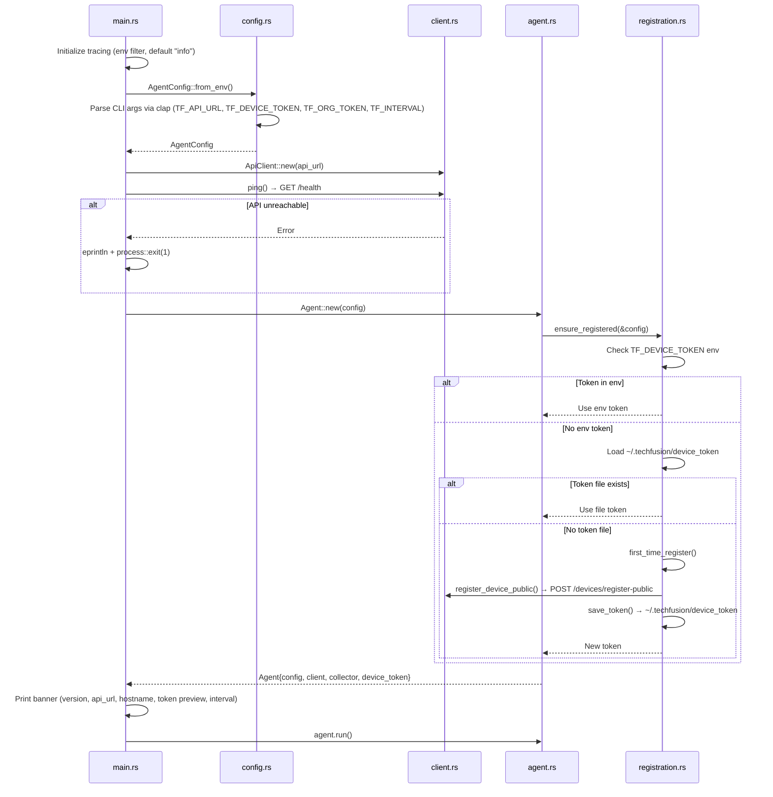

# AH-1D — Device Agent Discovery

> **Status:** Discovery only. No code changes made.

---

## Device Agent Overview

| Property | Value |
|----------|-------|
| Language | Rust (edition 2021) |
| Package | `agent` v1.0.0 |
| Entry point | `src/main.rs` |
| Binary name | `agent` |
| Async runtime | Tokio (full features) |
| HTTP client | reqwest 0.12 (rustls-tls) |
| CLI framework | clap 4 (derive + env) |
| System info | sysinfo 0.30 |
| Retry logic | tokio-retry 0.3 |
| Logging | tracing + tracing-subscriber |
| Storage | Filesystem (`~/.techfusion/device_token`) |
| Container | Dockerfile: `rust:latest` → `debian:bookworm-slim` |

### Source files (10 total)

| File | Lines | Compiled | Purpose |
|------|-------|:---:|---------|
| `src/main.rs` | 49 | ✅ | Entry point, startup orchestration |
| `src/agent.rs` | 101 | ✅ | Main loop, collect-and-send cycle, shutdown |
| `src/config.rs` | 70 | ✅ | CLI args, env loading, AgentConfig |
| `src/client.rs` | 296 | ✅ | HTTP client, payload structs, retry logic |
| `src/registration.rs` | 96 | ✅ | Device registration, token persistence |
| `src/collector.rs` | 112 | ✅ | System metrics collection via sysinfo |
| `src/remote.rs` | 279 | ❌ | Remote support (session, screen, input) |
| `src/inventory.rs` | 374 | ❌ | Driver/software inventory enumeration |
| `src/network_discovery.rs` | 428 | ❌ | ARP/ICMP network scanning |
| `src/security.rs` | 382 | ❌ | Security findings (updates, firewall, ports) |

**Critical finding:** 4 modules exist as files but are **not declared** in `main.rs` (`mod` statements). They are dead code — never compiled or executed.

---

## Startup Flow



### Configuration (`src/config.rs:4-11`)

| Field | Source | Required | Default |
|-------|--------|:---:|---------|
| `api_url` | `TF_API_URL` env or `--api-url` CLI | Yes | — |
| `device_token` | `TF_DEVICE_TOKEN` env or `--device-token` CLI | No* | `""` |
| `org_token` | `TF_ORG_TOKEN` env or `--org-token` CLI | No* | `None` |
| `interval_secs` | `TF_INTERVAL` env or `--interval-secs` CLI | No | `30` |
| `hostname` | sysinfo `System::host_name()` | Auto | `"unknown"` |

*Either `TF_DEVICE_TOKEN` (existing device) or `TF_ORG_TOKEN` (first-time registration) must be set.

---

## Registration Flow

**File:** `src/registration.rs:83-95`

### Token resolution order

1. **Environment token** (`TF_DEVICE_TOKEN`) — used directly if non-empty
2. **File token** (`~/.techfusion/device_token`) — loaded if file exists
3. **First-time registration** — uses `TF_ORG_TOKEN` JWT to call backend

### First-time registration (`src/registration.rs:14-60`)

1. Collects system info: CPU model/cores, RAM, disk total, OS name/version
2. Sends `POST /devices/register-public` with hardware fingerprint
3. Receives `{ device: { id, hostname }, deviceToken }` response
4. Saves token to `~/.techfusion/device_token`

### Token persistence

| Property | Value |
|----------|-------|
| Path | `~/.techfusion/device_token` |
| Directory | Created with `fs::create_dir_all` if missing |
| Format | Plain text file containing the token string |
| Fallback | `/tmp/.techfusion/device_token` if home dir unavailable |

### Registration payload (`src/client.rs:7-20`)

```json
{
  "name": "<hostname>",
  "hostname": "<hostname>",
  "os": "<sysinfo os name>",
  "osVersion": "<sysinfo os version>",
  "cpuModel": "<sysinfo cpu brand>",
  "cpuCores": <count>,
  "cpuLogical": <count>,
  "ramTotal": <bytes>,
  "diskTotal": <bytes>,
  "isLaptop": false,
  "agentVersion": "1.0.0"
}
```

**Note:** `isLaptop` is hardcoded to `false` (`src/client.rs:153`). `cpuLogical` is set to `cpuCores` (`src/registration.rs:49`), not the actual logical core count.

---

## Authentication

| Property | Value |
|----------|-------|
| Method | Bearer token in `Authorization` header |
| Token type | Device token (opaque string, not JWT) |
| Header format | `Authorization: Bearer <device_token>` |
| Token lifetime | No expiry mechanism in agent |
| Refresh mechanism | None |
| 401 handling | Logs warning "Device token rejected — will retry on next cycle" (`src/agent.rs:70-71`) |
| Re-registration on 401 | **Not implemented** |

---

## Device Identity

| Property | Value |
|----------|-------|
| Identifier | Device token (unique per device) |
| Display name | System hostname from `sysinfo::System::host_name()` |
| Hostname fallback | `"unknown"` if hostname unavailable |
| Token storage | `~/.techfusion/device_token` |
| Version | `1.0.0` (hardcoded in Cargo.toml and client.rs) |

---

## Module Map

### Active Modules (5)

#### 1. `main.rs` — Entry Point
- **Status:** Active
- **Purpose:** Initialize logging, load config, ping API, create Agent, run main loop
- **Dependencies:** agent, config, client

#### 2. `agent.rs` — Main Loop
- **Status:** Active
- **Purpose:** Periodic collect-and-send cycle with graceful shutdown
- **Dependencies:** client, collector, config, registration

**Main loop behavior (`src/agent.rs:28-45`):**
- Ticker fires every `interval_secs` (default 30s)
- First tick is consumed immediately (no delay before first send)
- On each tick: `collect_and_send()` — collects metrics, POSTs to backend
- On error: logs warning, continues loop
- Shutdown: handles SIGTERM (Unix) and Ctrl+C

#### 3. `config.rs` — Configuration
- **Status:** Active
- **Purpose:** Parse CLI args and environment variables into `AgentConfig`
- **Dependencies:** clap, sysinfo, std::env

#### 4. `client.rs` — HTTP Client & Payloads
- **Status:** Active
- **Purpose:** HTTP communication with backend API
- **Dependencies:** reqwest, tokio-retry, serde

**Payload structs:**
- `MetricsPayload` — top-level metrics envelope
- `CpuMetricsPayload` — CPU usage, cores, load averages
- `MemoryMetricsPayload` — RAM total, used, percent
- `DiskMetricsPayload` — disk total, used, read/write bytes
- `TemperaturesPayload` — CPU temperature
- `NetworkMetricsPayload` — rx/tx bytes
- `BatteryPayload` — battery percent, status
- `ServiceCheckPayload` — service name + status

#### 5. `collector.rs` — Metrics Collection
- **Status:** Active (partially implemented)
- **Purpose:** Collect system metrics via sysinfo crate
- **Dependencies:** sysinfo, chrono

#### 6. `registration.rs` — Device Registration
- **Status:** Active
- **Purpose:** Ensure device is registered, persist token
- **Dependencies:** client, config, sysinfo, dirs, std::fs

### Inactive Modules (4)

#### 7. `remote.rs` — Remote Support
- **Status:** Unused (not compiled)
- **Purpose:** Remote session management, screen capture, input control
- **Dependencies:** reqwest (blocking), serde, std::process::Command
- **Backend endpoints referenced:**
  - `GET /remote-support/agent/pending` — check for pending sessions
  - `POST /remote-support/consent` — send consent decision
  - `POST /remote-support/agent/status` — update session status
- **Features defined:**
  - Session polling, consent prompt (stdin), screen capture (ImageMagick `import`), input injection (`ydotool`/`xdotool`), active indicator file (`/tmp/techfusion_remote_active`)
- **Issues found:**
  - Uses `reqwest::blocking::Client` (not async) — incompatible with tokio runtime
  - Screen capture depends on `import` (ImageMagick) — may not be installed
  - Input injection depends on `ydotool` or `xdotool` — may not be installed
  - Consent prompt reads from stdin — not suitable for daemon mode
  - `base64_encode` is a hand-rolled implementation — could use `base64` crate

#### 8. `inventory.rs` — Driver & Software Inventory
- **Status:** Unused (not compiled)
- **Purpose:** Enumerate installed drivers and software packages
- **Dependencies:** serde, std::process::Command
- **Backend endpoints referenced:** None (data structures only, no send function)
- **Features defined:**
  - Driver enumeration: `lsmod`, `lspci -k`, `lsusb`, `dkms status`
  - Software enumeration: `dpkg-query`, `apt list`, `snap list`, `flatpak list`, `pip3 list`
  - Deduplication by name, sorted output

#### 9. `network_discovery.rs` — Network Scanning
- **Status:** Unused (not compiled)
- **Purpose:** Discover devices on local network via ARP and ICMP sweep
- **Dependencies:** serde, std::process::Command, std::net
- **Backend endpoints referenced:** None (data structures only, no send function)
- **Features defined:**
  - Local IP/subnet detection (`ip -4 addr`)
  - Gateway detection (`ip route show default`)
  - ARP table parsing (`/proc/net/arp`)
  - ICMP sweep (ping all hosts in subnet, max 512 hosts)
  - Hostname resolution (`host`/`nslookup`)
  - MAC vendor resolution (hardcoded OUI table, ~80 entries)
  - Includes unit tests

#### 10. `security.rs` — Security Scanning
- **Status:** Unused (not compiled)
- **Purpose:** Collect security findings from system configuration
- **Dependencies:** serde, serde_json, std::process::Command, reqwest (blocking)
- **Backend endpoints referenced:**
  - `POST /devices/security-report` — submit security findings
- **Features defined:**
  - Pending updates check (`apt list --upgradable`)
  - Firewall status (UFW or iptables)
  - Open ports (`ss -tlnp`)
  - Weak configs: empty passwords (`getent shadow`), SSH password auth, SSH root login
  - Password policy (`/etc/login.defs`)
- **Syntax error:** `src/security.rs:172` — missing closing brace in format string: `if exposed_services.len() == 1 { " is" else { "s are" }` (never compiled, so no build failure)

---

## Metrics Collection

### What IS collected (active pipeline)

| Metric | Source | Field | Status |
|--------|--------|-------|--------|
| CPU usage % | `sysinfo::System::global_cpu_info().cpu_usage()` | `cpu_usage_percent` | ✅ Implemented |
| CPU cores | `sysinfo::System::cpus().len()` | `cpu_cores` | ✅ Implemented |
| RAM total | `sysinfo::System::total_memory()` | `ram_total_bytes` | ✅ Implemented |
| RAM used | `sysinfo::System::used_memory()` | `ram_used_bytes` | ✅ Implemented |
| RAM percent | Calculated | `ram_usage_percent` | ✅ Implemented |
| Disk total | `sysinfo::Disks` (all disks summed) | `disk_total_bytes` | ✅ Implemented |
| Disk used | `total - available` | `disk_used_bytes` | ✅ Implemented |
| Disk percent | Calculated | `disk_usage_percent` | ✅ Implemented |
| Network rx | `sysinfo::Networks::total_received()` (all interfaces) | `network_rx_bytes` | ✅ Implemented |
| Network tx | `sysinfo::Networks::total_transmitted()` (all interfaces) | `network_tx_bytes` | ✅ Implemented |
| Process count | `sysinfo::System::processes().len()` | `process_count` | ✅ Implemented |
| Uptime | `sysinfo::System::uptime()` | `uptime_seconds` | ✅ Implemented |
| Hostname | `sysinfo::System::host_name()` | `hostname` | ✅ Implemented |
| OS name | `sysinfo::System::name()` | `os` | ✅ Implemented |
| OS version | `sysinfo::System::os_version()` | `os_version` | ✅ Implemented |
| Timestamp | `chrono::Utc::now().to_rfc3339()` | `timestamp` | ✅ Implemented |

### What is NOT collected (hardcoded to None)

| Metric | Schema field | Status | Evidence |
|--------|-------------|--------|----------|
| CPU temperature | `temperature_celsius` | **Stub** | `collector.rs:83` — `let temperature = None;` |
| Battery percent | `battery_percent` | **Stub** | `collector.rs:84` — `let battery_percent = None;` |
| Battery charging | `battery_charging` | **Stub** | `collector.rs:85` — `let battery_charging = None;` |
| Load averages | `loadAverage1Min/5Min/15Min` | **Not collected** | `client.rs:258-260` — hardcoded `None` |
| Disk read bytes | `readBytes` | **Not collected** | `client.rs:270` — hardcoded `None` |
| Disk write bytes | `writeBytes` | **Not collected** | `client.rs:271` — hardcoded `None` |
| Service checks | `services` | **Not collected** | `client.rs:293` — hardcoded `None` |

### What exists but is NOT connected

| Feature | Module | Backend endpoint | Status |
|---------|--------|-----------------|--------|
| Security scanning | `security.rs` | `POST /devices/security-report` | **Dead code** |
| Driver inventory | `inventory.rs` | None (no send function) | **Dead code** |
| Software inventory | `inventory.rs` | None (no send function) | **Dead code** |
| Network discovery | `network_discovery.rs` | None (no send function) | **Dead code** |
| Remote support | `remote.rs` | `GET /remote-support/agent/pending` | **Dead code** |
| Remote screen capture | `remote.rs` | (via remote session) | **Dead code** |
| Remote input control | `remote.rs` | (via remote session) | **Dead code** |

### Metrics payload mapping

The `build_metrics_payload` function (`src/client.rs:252-295`) maps `SystemMetrics` to `MetricsPayload`:

```
SystemMetrics → MetricsPayload
├── cpu_usage_percent → cpu.usage
├── cpu_cores → cpu.cores
├── ram_total_bytes → memory.total (as f64)
├── ram_used_bytes → memory.used (as f64)
├── ram_usage_percent → memory.percent
├── disk_total_bytes → disk.total (as f64)
├── disk_used_bytes → disk.used (as f64)
├── temperature_celsius → temperatures.cpu
├── network_rx_bytes → network.rxBytes (as f64)
├── network_tx_bytes → network.txBytes (as f64)
├── battery_percent → battery.percent
├── battery_charging → battery.status ("Charging"/"Discharging")
├── process_count → processes
├── uptime_seconds → uptime
└── timestamp → timestamp
```

---

## Backend Communication

### API Endpoints

| Method | Endpoint | Purpose | Auth | Used by |
|--------|----------|---------|------|---------|
| `GET` | `/health` | Health check / ping | None | `main.rs` (startup) |
| `POST` | `/devices/register-public` | Register new device | Org JWT (TF_ORG_TOKEN) | `registration.rs` |
| `POST` | `/devices/metrics` | Send metrics payload | Bearer device_token | `agent.rs` (loop) |
| `GET` | `/remote-support/agent/pending` | Check pending sessions | Bearer device_token | `remote.rs` (dead) |
| `POST` | `/remote-support/consent` | Send consent decision | Bearer device_token | `remote.rs` (dead) |
| `POST` | `/remote-support/agent/status` | Update session status | Bearer device_token | `remote.rs` (dead) |
| `POST` | `/devices/security-report` | Submit security findings | Bearer device_token | `security.rs` (dead) |

### Retry Strategy

**File:** `src/client.rs:193-230`

```
ExponentialBackoff:
  base: 10ms
  factor: 3
  max_delay: 30s
```

Retry behavior by HTTP status:

| Status | Action | Retried? |
|--------|--------|:---:|
| 200-299 | Success | No |
| 401 | Log "Device token rejected" | No (returns error immediately) |
| 429 | Sleep 60s, then retry | Yes |
| 500+ | Return error | Yes (exponential backoff) |
| Other | Return error | Yes (exponential backoff) |

**Limitation:** 401 is not retried — the agent logs a warning and continues to the next tick cycle without attempting re-registration.

### Scheduling

| Property | Value |
|----------|-------|
| Mechanism | Tokio `interval(Duration::from_secs(interval_secs))` |
| Default interval | 30 seconds |
| First tick | Consumed immediately (no initial delay) |
| Drift handling | Tokio interval drifts if a cycle takes longer than the interval |

### Heartbeat

No explicit heartbeat mechanism. The agent sends metrics at the configured interval, which implicitly serves as a heartbeat. If the backend doesn't receive metrics, it can infer the device is offline.

### Error Handling

| Scenario | Behavior |
|----------|----------|
| API unreachable at startup | `eprintln` + `process::exit(1)` (`main.rs:28-30`) |
| Metrics send failure | `tracing::warn`, continues loop (`agent.rs:69`) |
| Token rejected (401) | `tracing::warn`, continues loop, no re-registration (`agent.rs:70-71`) |
| Registration failure | Propagated as `anyhow::Error`, agent exits (`registration.rs:14-25`) |
| Token file write failure | Propagated as error, registration fails |
| SIGTERM / Ctrl+C | Graceful shutdown, returns `Ok(())` |

---

## Local Storage

| Property | Value |
|----------|-------|
| Token path | `~/.techfusion/device_token` |
| Fallback path | `/tmp/.techfusion/device_token` (if home dir unavailable) |
| Content | Plain text device token string |
| Created by | `registration.rs:62-71` — `fs::create_dir_all` + `fs::write` |
| Read by | `registration.rs:74-81` — `fs::read_to_string` |
| Permission | Default (umask-dependent) |
| Encryption | None |

No other local state is persisted. The agent is stateless between restarts except for the device token file.

---

## Scheduler

The agent uses a simple `tokio::time::interval` loop:

```rust
// agent.rs:29-44
let mut ticker = interval(Duration::from_secs(self.config.interval_secs));
ticker.tick().await; // consume first tick
loop {
    tokio::select! {
        _ = ticker.tick() => { collect_and_send().await }
        _ = shutdown_signal() => { return Ok(()) }
    }
}
```

- No scheduling of inventory collection
- No scheduling of security scans
- No scheduling of network discovery
- No scheduling of remote session polling
- Only metrics collection runs on the interval

---

## Active vs Inactive Modules

### Summary

| Module | Declared in main.rs | Compiled | Executed | Connected to main loop |
|--------|:---:|:---:|:---:|:---:|
| `main.rs` | — | ✅ | ✅ | — |
| `agent.rs` | ✅ | ✅ | ✅ | ✅ |
| `config.rs` | ✅ | ✅ | ✅ | ✅ |
| `client.rs` | ✅ | ✅ | ✅ | ✅ |
| `collector.rs` | ✅ | ✅ | ✅ | ✅ |
| `registration.rs` | ✅ | ✅ | ✅ | ✅ (startup only) |
| `remote.rs` | ❌ | ❌ | ❌ | ❌ |
| `inventory.rs` | ❌ | ❌ | ❌ | ❌ |
| `network_discovery.rs` | ❌ | ❌ | ❌ | ❌ |
| `security.rs` | ❌ | ❌ | ❌ | ❌ |

### Dependencies

| Dependency | Version | Used by (active) | Used by (dead) |
|------------|---------|:---:|:---:|
| tokio | 1 (full) | main, agent | remote (blocking, conflict) |
| reqwest | 0.12 (json, rustls-tls) | client, registration | remote (blocking), security (blocking) |
| serde | 1 (derive) | client, collector | remote, inventory, network_discovery, security |
| serde_json | 1 | client | remote, inventory, network_discovery, security |
| sysinfo | 0.30 | collector, registration | — |
| clap | 4 (derive, env) | config | — |
| tracing | 0.1 | main, agent, registration, client | — |
| tracing-subscriber | 0.3 (env-filter) | main | — |
| uuid | 1 (v4) | — (unused in active code) | — |
| anyhow | 1 | main, agent, config, client, registration | — |
| tokio-retry | 0.3 | client | — |
| chrono | 0.4 (serde) | collector | remote |
| dirs | 5 | registration | — |

**Unused dependency in active code:** `uuid` is declared in `Cargo.toml` but not imported or used by any active module.

---

## Supported Operating Systems

| Requirement | Evidence |
|-------------|----------|
| Linux only | Reads `/proc/net/arp` (`network_discovery.rs:75,90`), `/sys/class/net/` (`network_discovery.rs:57,294`), uses `ip` command |
| SIGTERM handler | `#[cfg(unix)]` guard in `agent.rs:86` |
| Docker support | Dockerfile builds `debian:bookworm-slim` image |
| No Windows/macOS support | Agent relies on Linux-specific paths and commands |

### Required privileges

| Operation | Privilege needed |
|-----------|-----------------|
| Metrics collection | None (sysinfo works as unprivileged user) |
| Device registration | None |
| Security scan (dead) | Root (reads `/etc/shadow`, `/etc/ssh/sshd_config`, `/etc/login.defs`) |
| Network discovery (dead) | Root (raw ICMP ping, ARP table access) |
| Remote input (dead) | Root or input group (`ydotool`/`xdotool`) |
| Remote screen (dead) | Display server access |

### Background service

No systemd unit file, init script, or process manager configuration is provided. The agent runs as a foreground process. For production, a systemd service or Docker container would be needed.

### Update mechanism

No auto-update mechanism exists. Version is hardcoded as `1.0.0` in `Cargo.toml:3` and `client.rs:154`. Updates require rebuilding and redeploying the binary.

### Offline behavior

If the backend is unreachable during the metrics cycle:
1. `reqwest` returns a connection error
2. `tokio-retry` retries with exponential backoff (10ms → 30ms → 90ms → ... → 30s max)
3. After exhausting retries, logs a warning
4. Agent continues running and waits for the next tick
5. No local data buffering or queuing

---

## Production Readiness

### Production-ready components

| Component | Assessment |
|-----------|-----------|
| Startup sequence | ✅ Health check, graceful config loading |
| Configuration | ✅ CLI + env var support, clear error messages |
| Registration | ✅ Two-path (env token or first-time), token persistence |
| Metrics collection | ✅ Core metrics (CPU, RAM, disk, network, processes, uptime) |
| HTTP client | ✅ Timeout (30s), retry with exponential backoff |
| Graceful shutdown | ✅ SIGTERM + Ctrl+C handling |
| Logging | ✅ Structured tracing with env filter |
| Containerization | ✅ Multi-stage Dockerfile |

### Missing integrations

| Feature | Status | Gap |
|---------|--------|-----|
| Security scanning | Module exists, not compiled | `security.rs` not declared in `main.rs` |
| Driver/software inventory | Module exists, not compiled | `inventory.rs` not declared, no send function |
| Network discovery | Module exists, not compiled | `network_discovery.rs` not declared, no send function |
| Remote support | Module exists, not compiled | `remote.rs` not declared, uses blocking HTTP |
| Temperature collection | Stub (hardcoded None) | No platform-specific implementation |
| Battery collection | Stub (hardcoded None) | No platform-specific implementation |
| Load averages | Stub (hardcoded None in payload) | Not collected or sent |
| Service checks | Stub (hardcoded None in payload) | Not collected or sent |
| Disk I/O | Stub (hardcoded None in payload) | Not collected or sent |
| Auto-update | Not implemented | No version checking or update mechanism |
| Systemd service | Not provided | No daemon configuration |
| Token encryption | Not implemented | Plain text file |

### Dead modules

| Module | Lines | Reason dead |
|--------|-------|-------------|
| `remote.rs` | 279 | Not declared in `main.rs` mod list |
| `inventory.rs` | 374 | Not declared in `main.rs` mod list |
| `network_discovery.rs` | 428 | Not declared in `main.rs` mod list |
| `security.rs` | 382 | Not declared in `main.rs` mod list |

**Total dead code:** 1,463 lines across 4 modules.

### Placeholder implementations

| Placeholder | Location | Reality |
|-------------|----------|---------|
| `isLaptop: false` | `client.rs:153` | Always false, never detected |
| `cpuLogical = cpuCores` | `registration.rs:49` | Logical cores not distinguished from physical |
| `temperature = None` | `collector.rs:83` | Never collected |
| `battery_percent = None` | `collector.rs:84` | Never collected |
| `battery_charging = None` | `collector.rs:85` | Never collected |
| `loadAverage = None` | `client.rs:258-260` | Never collected |
| `services = None` | `client.rs:293` | Never collected |
| `readBytes = None` | `client.rs:270` | Never collected |
| `writeBytes = None` | `client.rs:271` | Never collected |

---

## Known Gaps

1. **4 modules (1,463 lines) are dead code.** Remote support, inventory, network discovery, and security scanning are fully implemented but never compiled or executed.

2. **No re-registration on 401.** When the device token is rejected, the agent logs a warning and continues. It never attempts to re-register with the org token.

3. **Temperature and battery are hardcoded to None.** The `sysinfo` crate supports temperature on some platforms but the agent doesn't use it.

4. **Network bytes are cumulative totals.** `sysinfo::Networks::total_received()` returns lifetime totals, not per-interval deltas. The backend receives ever-increasing values, not rates.

5. **No systemd unit or process manager.** The agent runs as a foreground process with no daemonization support.

6. **`isLaptop` is always false.** No laptop detection logic exists.

7. **`cpuLogical` is identical to `cpuCores`.** The agent doesn't distinguish physical cores from logical (hyperthreaded) cores.

8. **Dead code has a syntax error.** `security.rs:172` has a malformed format string (missing closing brace). This compiles only because the module is never included.

9. **Dead modules use `reqwest::blocking`.** `remote.rs` and `security.rs` use `reqwest::blocking::Client`, which is incompatible with the tokio async runtime used by the active agent. Integrating them would require refactoring to async.

10. **`uuid` crate is declared but unused.** Listed as a dependency in `Cargo.toml:19` but never imported in active code.

11. **No local data buffering.** If the backend is unreachable, metrics are lost — no queue, no local persistence, no retry across tick cycles.

12. **Token file has no access control.** `~/.techfusion/device_token` is created with default permissions (umask-dependent). On a shared system, other users could read the token.

---

*Discovery completed. No code changes, package installations, or modifications were made.*
