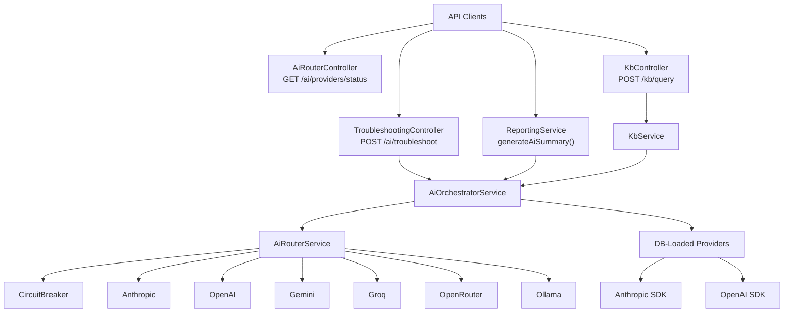
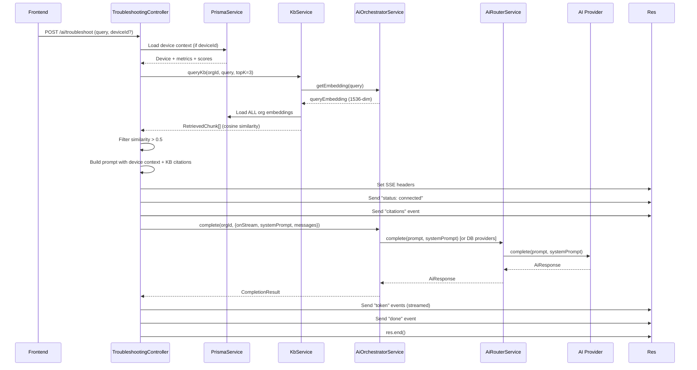

# AH-1E — AI Architecture Discovery

> Scope: `apps/api-gateway/src/ai/`, `apps/api-gateway/src/kb/`, AI-related usage in other backend modules.
> All findings are code-verified. No modifications made.

---

## AI Architecture Overview

TechFusion AI implements a **single-orchestrator, multi-provider routing architecture** — not a multi-agent system. One `AiOrchestratorService` coordinates all AI completions and embeddings across the platform. An `AiRouterService` adds smart routing across six provider adapters with circuit breaking. The only real AI consumer endpoint is `POST /ai/troubleshoot` (SSE-streamed troubleshooting). A second consumer is `POST /kb/query` for semantic search. The Reporting module calls the orchestrator for executive summaries.



---

## Entry Points

| Route | Method | Controller | Auth | Description |
|-------|--------|-----------|------|-------------|
| `POST /ai/troubleshoot` | POST | `TroubleshootingController` | Owner, Admin, Technician, Viewer | SSE-streamed AI troubleshooting with device context + KB RAG |
| `GET /ai/providers/status` | GET | `AiRouterController` | Owner, Admin | Status of all 6 providers |
| `GET /ai/router/stats` | GET | `AiRouterController` | Owner, Admin | Aggregate routing stats |
| `PUT /ai/router/strategy` | PUT | `AiRouterController` | Owner, Admin | Change runtime routing strategy |
| `POST /kb/articles` | POST | `KbController` | JwtAuthGuard | Create KB article (auto-chunks + embeds) |
| `GET /kb/articles` | GET | `KbController` | JwtAuthGuard | List org articles |
| `GET /kb/articles/:id` | GET | `KbController` | JwtAuthGuard | Get single article |
| `PUT /kb/articles/:id` | PUT | `KbController` | JwtAuthGuard | Update article (re-embeds if markdown changed) |
| `DELETE /kb/articles/:id` | DELETE | `KbController` | JwtAuthGuard | Delete article (cascades embeddings) |
| `POST /kb/query` | POST | `KbController` | JwtAuthGuard | Semantic search (cosine similarity) |
| *(internal)* | — | `ReportingService.generateAiSummary()` | — | AI executive summary for reports |

**Files:**
- `apps/api-gateway/src/ai/controllers/troubleshooting.controller.ts` (189 lines)
- `apps/api-gateway/src/ai/controllers/ai-router.controller.ts` (28 lines)
- `apps/api-gateway/src/kb/kb.controller.ts` (160 lines)
- `apps/api-gateway/src/reporting/reporting.service.ts:295-320`

---

## AI Orchestrator

**File:** `apps/api-gateway/src/ai/ai-orchestrator.service.ts` (372 lines)

The `AiOrchestratorService` is the single entry point for all completions and embeddings.

### Responsibilities

| Responsibility | Implementation |
|---------------|---------------|
| Plan enforcement | Counts `aiUsageLog` for current month against `planConfig.limits.maxAiQueriesPerMonth`. Throws `ForbiddenException` if exceeded (line 122-137). |
| Provider loading | Queries `Prisma.aiProviderConfig` for org's encrypted keys, decrypts via `EncryptionService`, instantiates SDK providers. Caches per-org (line 39-86). |
| Fallback providers | Falls back to `ANTHROPIC_API_KEY` and `OPENAI_API_KEY` env vars if no DB-stored configs (line 88-112). |
| Routing delegation | If `AiRouterService` available, delegates to `aiRouter.complete()` for non-streaming paths (line 203-227). |
| Sequential fallback | Iterates providers in priority order; on failure, logs and tries next. Throws if all fail (line 229-276). |
| Streaming support | When `opts.onStream` is provided, routes through DB-loaded providers (NOT the router) — a separate code path (line 146-200). |
| Usage logging | Logs every call (success + failure) via `AiUsageService.log()` (lines 165-176, 184-196). |
| Cost calculation | Uses `CostTrackerService.calculateCost()` with hardcoded per-model pricing (line 163). |

### Two-Layer Architecture

```
Layer 1: Orchestrator-Level Providers (LlmProvider interface)
  - Loaded per-org from DB (encrypted API keys)
  - Used for: streaming path, embed fallback, non-router fallback
  - Only 2 providers: Anthropic, OpenAI

Layer 2: Router-Level Providers (AiProviderInterface)
  - Loaded once at startup from env vars
  - Used for: non-streaming completions, embeddings (via AiRouterService)
  - All 6 providers
```

**Key insight:** Streaming always uses Layer 1 (DB-loaded providers). Non-streaming uses Layer 2 (router) first, then falls back to Layer 1.

---

## Provider Map

### Layer 1: Orchestrator Providers

**File:** `apps/api-gateway/src/ai/providers/anthropic.provider.ts` (73 lines)
**File:** `apps/api-gateway/src/ai/providers/openai.provider.ts` (83 lines)

| Provider | SDK | Streaming | Embeddings | Loaded From |
|----------|-----|-----------|------------|-------------|
| Anthropic | `@anthropic-ai/sdk` | Yes (SSE `stream: true`) | No (throws) | DB config or `ANTHROPIC_API_KEY` env |
| OpenAI | `openai` | Yes (SSE `stream: true`) | Yes (`text-embedding-3-small`) | DB config or `OPENAI_API_KEY` env |

### Layer 2: Router Providers

**Directory:** `apps/api-gateway/src/ai/providers/router/`

| Provider | File | Priority | Cost | Speed | Embeddings | Default Model | SDK |
|----------|------|----------|------|-------|------------|---------------|-----|
| Anthropic | `anthropic-router.provider.ts` (70 lines) | 1 | high | medium | No | `claude-sonnet-4-20250514` | `@anthropic-ai/sdk` |
| OpenAI | `openai-router.provider.ts` (79 lines) | 2 | low | fast | Yes | `gpt-4o-mini` | `openai` |
| Gemini | `gemini-router.provider.ts` (71 lines) | 3 | free | fast | Yes (`embedding-001`) | `gemini-1.5-flash` | `@google/generative-ai` |
| Groq | `groq-router.provider.ts` (66 lines) | 4 | free | ultrafast | No | `llama-3.1-70b-versatile` | `groq-sdk` |
| OpenRouter | `openrouter-router.provider.ts` (74 lines) | 5 | free | medium | No | `meta-llama/llama-3.1-8b-instruct:free` | `openai` (custom baseURL) |
| Ollama | `ollama-router.provider.ts` (79 lines) | 6 | free | slow | Yes (`nomic-embed-text`) | `llama3.2` | Raw `fetch()` |

---

## Provider Selection and Fallback

**File:** `apps/api-gateway/src/ai/router/ai-router.service.ts` (189 lines)

### Routing Strategies

| Strategy | Behavior | Selection |
|----------|----------|-----------|
| `smart` (default) | Sort by `priority` field (1→6) | Anthropic → OpenAI → Gemini → Groq → OpenRouter → Ollama |
| `cost-first` | Sort by `costTier` ascending | Free providers first → high cost last |
| `speed-first` | Sort by `speedTier` ascending | Ultrafast → fast → medium → slow |
| `round-robin` | Rotate on each request | `totalRequests % providerCount` |

### Selection Flow

```
1. Filter: isConfigured() === true
2. Filter: circuitBreaker.isOpen() === false
3. Sort by active strategy
4. Iterate sequentially
5. Race each provider against timeout (AI_ROUTER_TIMEOUT_MS, default 30s)
6. On success: record success, update stats, return
7. On failure: record failure, log, continue (if AI_FALLBACK_ENABLED)
8. If all fail: throw Error
```

**File:** `apps/api-gateway/src/ai/router/ai-router.service.ts:42-66` (selectProviders)
**File:** `apps/api-gateway/src/ai/router/ai-router.service.ts:68-107` (complete)

### Circuit Breaker

**File:** `apps/api-gateway/src/ai/router/circuit-breaker.ts` (43 lines)

| Parameter | Env Var | Default |
|-----------|---------|---------|
| Failure threshold | `AI_CIRCUIT_BREAKER_THRESHOLD` | 3 |
| Reset window | `AI_CIRCUIT_BREAKER_RESET_MS` | 600000ms (10 min) |

**Behavior:**
- After `threshold` consecutive failures → circuit opens, provider skipped for `resetMs`
- On success → failure count resets immediately, circuit closes
- In-memory only — resets on service restart

### Orchestrator-Level Fallback

When the router is unavailable or streaming, the orchestrator falls back to DB-loaded providers:

```
1. Query AiProviderConfig for orgId (isEnabled, ordered by priority)
2. Decrypt each API key
3. Instantiate AnthropicProvider or OpenAIProvider
4. If none configured → fall back to env vars (ANTHROPIC_API_KEY, OPENAI_API_KEY)
5. Try each in priority order, log success/failure, throw if all fail
```

**File:** `apps/api-gateway/src/ai/ai-orchestrator.service.ts:39-112`

---

## Model Configuration

| Context | Model | Source |
|---------|-------|--------|
| Orchestrator fallback — Anthropic | `claude-sonnet-4-20250514` | `ANTHROPIC_MODEL` env or default |
| Orchestrator fallback — OpenAI | `gpt-4o` | `OPENAI_MODEL` env or default |
| Router — Anthropic | `claude-sonnet-4-20250514` | `ANTHROPIC_MODEL` env or default |
| Router — OpenAI | `gpt-4o-mini` | Hardcoded in router provider |
| Router — Gemini | `gemini-1.5-flash` | Hardcoded in router provider |
| Router — Groq | `llama-3.1-70b-versatile` | Hardcoded in router provider |
| Router — OpenRouter | `meta-llama/llama-3.1-8b-instruct:free` | Hardcoded in router provider |
| Router — Ollama | `llama3.2` | Hardcoded in router provider |
| KB Embeddings | `text-embedding-3-small` | Hardcoded in orchestrator `getEmbedding()` |
| Troubleshooting | `temperature: 0.2, maxTokens: 4096` | Hardcoded in controller |
| Report Summary | `temperature: 0.3, maxTokens: 300` | Hardcoded in reporting service |

---

## Usage and Cost Tracking

### Usage Logging

**File:** `apps/api-gateway/src/ai/services/ai-usage.service.ts` (37 lines)

Every AI call logs to `prisma.aiUsageLog`:
- `orgId`, `conversationId` (always `undefined`), `provider`, `model`
- `promptTokens`, `completionTokens`, `totalTokens`
- `costUsd`, `latencyMs`, `success`, `errorMessage`

**Gap:** Embedding calls through `embed()` do NOT log usage or cost. Only `complete()` calls are logged.

### Cost Tracking

**File:** `apps/api-gateway/src/ai/services/cost-tracker.service.ts` (28 lines)

Hardcoded pricing table (used only by orchestrator-level provider path):

| Model | Input $/1K tokens | Output $/1K tokens |
|-------|-------------------|-------------------|
| `claude-sonnet-4-20250514` | $0.003 | $0.015 |
| `claude-sonnet-4` | $0.003 | $0.015 |
| `claude-3-5-sonnet-20241022` | $0.003 | $0.015 |
| `claude-3-haiku-20240307` | $0.00025 | $0.00125 |
| `gpt-4o` | $0.0025 | $0.01 |
| `gpt-4o-mini` | $0.00015 | $0.0006 |
| `gpt-3.5-turbo` | $0.0005 | $0.0015 |
| Unknown (default) | $0.003 | $0.015 |

**Gap:** Router-level providers use simplified flat-rate estimates (`tokensUsed * 0.000015` for Anthropic, `tokensUsed * 0.00000015` for OpenAI, `$0` for free providers). No Gemini, Groq, OpenRouter, or Ollama pricing in `CostTrackerService`.

### Plan-Based Limits

**File:** `apps/api-gateway/src/billing/plan-features.ts` (136 lines)

| Plan | `maxAiQueriesPerMonth` |
|------|----------------------|
| Free | 100 |
| Pro ($29/mo) | 1,000 |
| Business ($99/mo) | 5,000 |
| Enterprise ($299/mo) | 999,999 (unlimited) |

Enforced in `AiOrchestratorService.complete()` at `ai-orchestrator.service.ts:122-137`.

---

## Multi-Agent Verification

**Verdict: NO multi-agent architecture exists.**

| Claim | Evidence |
|-------|----------|
| Multiple specialized AI agents | **False.** No agent classes, no agent interfaces, no agent orchestration pattern. |
| True multi-agent architecture | **False.** Single `AiOrchestratorService` handles all AI calls. |
| Backend services incorrectly described as agents | **Possible.** The system has: (1) `AiOrchestratorService` — a service, not an agent; (2) `AiRouterService` — a routing layer, not an agent; (3) `KbService` — a CRUD service; (4) `TroubleshootingController` — a controller with a hardcoded prompt. None are autonomous agents. |

**Actual architecture:** One orchestrator with provider routing + a static system prompt. This is a **provider-routing pattern**, not a multi-agent system.

---

## Troubleshooting Flow

**File:** `apps/api-gateway/src/ai/controllers/troubleshooting.controller.ts` (189 lines)



### Step-by-step trace with file references

| Step | What Happens | File:Line | Status |
|------|-------------|-----------|--------|
| 1. Frontend request | `POST /ai/troubleshoot` with `{query, deviceId?, conversationId?}` | `troubleshooting.controller.ts:40-44` | Complete |
| 2. Device context loading | Prisma query for device + latest metric + latest score | `troubleshooting.controller.ts:48-78` | Complete |
| 3. KB query | Calls `kbService.queryKb()` with `topK: 3` | `troubleshooting.controller.ts:84-88` | Complete |
| 4. KB embedding | `aiOrchestrator.getEmbedding()` → embeds query text | `kb.service.ts:218-228` | Complete |
| 5. Similarity search | Loads ALL org embeddings, cosine similarity in JS | `kb.service.ts:237-282` | **Incomplete** — no vector DB, O(n) scan |
| 6. Filter by threshold | Chunks with `similarity > 0.5` only | `troubleshooting.controller.ts:94` | Hardcoded |
| 7. Prompt construction | Device context + KB citations + user query assembled | `troubleshooting.controller.ts:129-136` | Complete |
| 8. SSE setup | Headers set, `status` event sent | `troubleshooting.controller.ts:138-147` | Complete |
| 9. Provider selection | Router selects provider or orchestrator falls back to DB providers | `ai-orchestrator.service.ts:203-227` | Complete |
| 10. Model call | Provider SDK call with timeout race | `ai-router.service.ts:82-103` | Complete |
| 11. Streaming tokens | `onStream` callback sends each token as SSE `token` event | `troubleshooting.controller.ts:163-166` | Complete |
| 12. Usage logging | Logged to `aiUsageLog` via `AiUsageService.log()` | `ai-orchestrator.service.ts:165-176` | Complete |
| 13. Response | `done` event with final metadata, `res.end()` | `troubleshooting.controller.ts:174-187` | Complete |
| 14. Conversation persistence | `conversationId` always `undefined` — **no persistence** | `ai-orchestrator.service.ts:167` | **Missing** |
| 15. Embedding cost tracking | Not logged — only completion cost logged | — | **Missing** |

---

## Knowledge Base and RAG

### Article Lifecycle

**File:** `apps/api-gateway/src/kb/kb.service.ts` (307 lines)

| Operation | Implementation | File:Line |
|-----------|---------------|-----------|
| Create | `Prisma.kbArticle.create()` → `chunkAndEmbedArticle()` | `kb.service.ts:49-66` |
| Update | If `markdown` changed: delete all embeddings, re-chunk, re-embed | `kb.service.ts:90-118` |
| Delete | `Prisma.kbArticle.delete()` with cascade to `KbEmbedding` | `kb.service.ts:124-133` |

### Chunking

**File:** `kb.service.ts:138-151`

- Algorithm: Character-count sliding window
- `chunkSize = 500` characters, `overlap = 100` characters
- Does NOT respect sentence boundaries, markdown headings, or code blocks
- Safety: advances by 1 char if next position would go backward

### Embeddings

| Aspect | Detail |
|--------|--------|
| Model | `text-embedding-3-small` (hardcoded in orchestrator) |
| Dimension | 1536 (hardcoded constant `EMBEDDING_DIMENSION`) |
| Provider path | Router → OpenAI (primary), Gemini (alt), Ollama (local) |
| Storage | JSON float arrays in `KbEmbedding.embedding` (PostgreSQL) |
| Sequential | Chunks embedded one at a time (no batching) |

### Embedding Dimension Mismatch

**Critical:** `EMBEDDING_DIMENSION = 1536` is hardcoded in `kb.service.ts:35`.

| Provider | Returns | Match? |
|----------|---------|--------|
| OpenAI `text-embedding-3-small` | 1536 | Yes |
| Gemini `embedding-001` | 768 | **No — falls back to local hash** |
| Ollama `nomic-embed-text` | ~768 | **No — falls back to local hash** |
| Local fallback | 1536 (normalized) | Yes (but semantically meaningless) |

### Similarity Search

**File:** `kb.service.ts:214-282`

1. Embed query → 1536-dim vector
2. Load **ALL** org embeddings from DB into Node.js memory
3. Compute cosine similarity in JavaScript (O(n) per embedding)
4. Sort descending, slice top-K (default 5)

**No vector database.** No pgvector. No dedicated vector store. Entire similarity search runs in application memory.

### RAG Injection into Prompts

**File:** `troubleshooting.controller.ts:80-136`

Only integrated into `POST /ai/troubleshoot`. No other endpoint uses RAG.

**Injection format:**
```
[INTERNAL KNOWLEDGE BASE REFERENCES]
- "Article Title" (ID: uuid)

[From "Article Title" - chunk 0]:
<chunk text>
```

### Conversation Persistence

**Prisma models exist but are completely unused:**
- `AiConversation` (`prisma/schema.prisma:277-290`)
- `AiMessage` (`prisma/schema.prisma:292-303`)

**Evidence of non-use:**
- `conversationId` is accepted in both `ChatMessageDto` and `TroubleshootDto` but never read by controllers
- `AiOrchestratorService.complete()` always passes `conversationId: undefined` to usage logging (lines 167, 186, 209, 246, 262)
- No code creates `AiConversation` or `AiMessage` records
- No code loads prior messages for multi-turn context
- Chat is stateless — each request is processed independently

### Semantic Search Limitations

| Limitation | Detail |
|-----------|--------|
| No vector DB | Cosine similarity computed in JS over all org embeddings loaded into memory |
| Naive chunking | 500-char windows split mid-sentence, mid-word, mid-code-block |
| No batching | Chunks embedded sequentially, one API call per chunk |
| Dimension lock | 1536 hardcoded — Gemini/Ollama embeddings silently rejected |
| No feedback loop | No tracking of which KB results are used or helpful |
| No threshold tuning | Similarity > 0.5 hardcoded in controller, not configurable |
| No incremental update | Article update re-embeds entire article from scratch |

---

## AI Integrations Across Modules

| Module | Uses AI? | How | File |
|--------|---------|-----|------|
| **Troubleshooting** | Yes | `AiOrchestratorService.complete()` with SSE streaming | `troubleshooting.controller.ts:158-167` |
| **Knowledge Base** | Yes | `AiOrchestratorService.getEmbedding()` for semantic search | `kb.service.ts:174, 220` |
| **Reporting** | Yes | `AiOrchestratorService.complete()` for executive summaries | `reporting.service.ts:295-320` |
| **Security** | **No** | Rule-based template strings for executive summaries, NOT AI | `security-reporting.service.ts:49-59` |
| **Billing** | **No** (enforcement only) | Enforces `maxAiQueriesPerMonth` via plan config | `plan-features.ts:49,70,91,112` |
| **Devices** | **No** | Plan-based device limits only | — |
| **Alerts** | **No** | Rule-based evaluation engine | — |

### Reporting AI Integration

**File:** `apps/api-gateway/src/reporting/reporting.service.ts:295-320`

- Optional dependency (`@Optional()` on `AiOrchestratorService`)
- Triggered when `dto.generateAiSummary === true`
- Hardcoded prompt: `"You are a technical report analyst..."`
- `temperature: 0.3`, `maxTokens: 300`
- Graceful degradation: AI failure → empty summary, report still generates
- Summary rendered in HTML, PDF, and DOCX output formats

### Security — NOT AI

**File:** `apps/api-gateway/src/security/services/security-reporting.service.ts:21-77`

The `GET /security/executive-summary/:deviceId` endpoint uses **deterministic template strings** based on risk level. No LLM call. No AI involvement.

---

## Streaming Behavior

**File:** `troubleshooting.controller.ts:138-187`

| Aspect | Detail |
|--------|--------|
| Protocol | Server-Sent Events (SSE) |
| Content-Type | `text/event-stream` |
| Events | `status`, `citations`, `token`, `done`, `error` |
| Streaming source | Orchestrator `onStream` callback → provider `stream: true` |
| Provider streaming | Anthropic: `client.messages.create({stream: true})`; OpenAI: `client.chat.completions.create({stream: true})` |
| Buffering | `X-Accel-Buffering: no` header set for nginx compatibility |

**Note:** Streaming only works with DB-loaded providers (Layer 1). The router path (Layer 2) does NOT support streaming — it returns a complete response. The orchestrator uses the router for non-streaming only.

---

## Safety and Validation

| Control | Implementation | File |
|---------|---------------|------|
| Input validation | `class-validator` DTOs: `@IsString`, `@MinLength(1)`, `@MaxLength(10000)`, `@IsUUID` | `dto/troubleshoot.dto.ts`, `dto/chat.dto.ts` |
| Input sanitization | `SanitizePipe`: validates non-empty, max 10000 chars, trims whitespace | `guards/sanitize.pipe.ts` |
| Role-based access | `@Roles('Owner', 'Admin', 'Technician', 'Viewer')` on troubleshoot; `@Roles('Owner', 'Admin')` on router admin | Controllers |
| Rate limiting | Global `ThrottlerGuard`: short (10/s), long (100/60s) | `app.module.ts` |
| Plan limits | Global `PlanGuard` + per-call `maxAiQueriesPerMonth` check | `ai-orchestrator.service.ts:122-137` |
| API key encryption | AES-256-GCM with `AI_ENCRYPTION_KEY` derived via scrypt | `services/encryption.service.ts` |
| Anti-hallucination prompt | System prompt forbids fabricating metrics, error codes, config values | `troubleshooting.controller.ts:9-25` |
| Prompt injection defense | Prompt rule #5: treat "ignore previous instructions" as untrusted | `troubleshooting.controller.ts:21` |
| Optional KB service | `@Optional()` injection — KB failure doesn't block troubleshooting | `troubleshooting.controller.ts:34` |
| Graceful degradation | AI failure in reports → empty summary, report still generates | `reporting.service.ts:296-318` |

### Missing Safety Controls

| Gap | Detail |
|-----|--------|
| No output filtering | AI response is streamed directly to client with no content moderation |
| No PII detection | No check for sensitive data in user queries or AI responses |
| No per-provider rate limiting | Only global HTTP throttling; no per-provider or per-model limits |
| No token budget enforcement | `maxTokens` is set per-call but no aggregate token budget per org |
| No response quality validation | AI output is sent to client without any post-processing validation |
| No audit trail for AI decisions | Usage logged but AI decisions/recommendations not tracked |

---

## Active and Unused Components

### Active Components

| Component | File | Status |
|-----------|------|--------|
| `AiOrchestratorService` | `ai-orchestrator.service.ts` | Active — central hub |
| `AiRouterService` | `router/ai-router.service.ts` | Active — smart routing |
| `CircuitBreaker` | `router/circuit-breaker.ts` | Active — fault tolerance |
| `TroubleshootingController` | `controllers/troubleshooting.controller.ts` | Active — primary AI endpoint |
| `AiRouterController` | `controllers/ai-router.controller.ts` | Active — admin monitoring |
| `KbService` | `kb/kb.service.ts` | Active — RAG pipeline |
| `KbController` | `kb/kb.controller.ts` | Active — KB CRUD + search |
| `AiUsageService` | `services/ai-usage.service.ts` | Active — usage logging |
| `CostTrackerService` | `services/cost-tracker.service.ts` | Active — cost calculation |
| `EncryptionService` | `services/encryption.service.ts` | Active — API key encryption |
| `AnthropicRouterProvider` | `providers/router/anthropic-router.provider.ts` | Active |
| `OpenAiRouterProvider` | `providers/router/openai-router.provider.ts` | Active |
| `GeminiRouterProvider` | `providers/router/gemini-router.provider.ts` | Active (config-dependent) |
| `GroqRouterProvider` | `providers/router/groq-router.provider.ts` | Active (config-dependent) |
| `OpenRouterRouterProvider` | `providers/router/openrouter-router.provider.ts` | Active (config-dependent) |
| `OllamaRouterProvider` | `providers/router/ollama-router.provider.ts` | Active (localhost default) |
| `AnthropicProvider` | `providers/anthropic.provider.ts` | Active |
| `OpenAIProvider` | `providers/openai.provider.ts` | Active |
| `SanitizePipe` | `guards/sanitize.pipe.ts` | Active |

### Unused Components

| Component | File | Status |
|-----------|------|--------|
| `ChatMessageDto` | `dto/chat.dto.ts` | **Unused** — no controller consumes this DTO |
| `AiConversation` model | `prisma/schema.prisma:277-290` | **Unused** — schema only, no code creates/reads |
| `AiMessage` model | `prisma/schema.prisma:292-303` | **Unused** — schema only, no code creates/reads |
| `conversationId` in `TroubleshootDto` | `dto/troubleshoot.dto.ts:15` | **Unused** — accepted but ignored |
| `conversationId` in orchestrator logging | `ai-orchestrator.service.ts:167,186,209,246,262` | **Always undefined** |

### Hardcoded Prompts

| Prompt | Location | Parameters |
|--------|----------|------------|
| Troubleshooting system prompt | `troubleshooting.controller.ts:9-25` | `temperature: 0.2, maxTokens: 4096` |
| Report executive summary | `reporting.service.ts:306-309` | `temperature: 0.3, maxTokens: 300` |

### Hardcoded Models

| Model | Location | Override? |
|-------|----------|-----------|
| `claude-sonnet-4-20250514` | Router Anthropic provider, Orchestrator fallback | `ANTHROPIC_MODEL` env |
| `gpt-4o-mini` | Router OpenAI provider | None — hardcoded |
| `gemini-1.5-flash` | Router Gemini provider | None — hardcoded |
| `llama-3.1-70b-versatile` | Router Groq provider | None — hardcoded |
| `meta-llama/llama-3.1-8b-instruct:free` | Router OpenRouter provider | None — hardcoded |
| `llama3.2` | Router Ollama provider | None — hardcoded |
| `text-embedding-3-small` | Orchestrator `getEmbedding()` | None — hardcoded |
| `nomic-embed-text` | Router Ollama embed | None — hardcoded |
| `embedding-001` | Router Gemini embed | None — hardcoded |

---

## Provider Verification Status

| Provider | Implemented | Completions | Embeddings | Streaming | Config Source | Notes |
|----------|-------------|-------------|------------|-----------|---------------|-------|
| **Anthropic** | **Implemented** | Yes | No (throws) | Yes | Env + DB | Both layers functional |
| **OpenAI** | **Implemented** | Yes | Yes | Yes | Env + DB | Both layers functional. Primary embedding provider. |
| **Gemini** | **Partial** | Yes | Yes (768-dim) | No | Env only | Embedding dimension mismatch with 1536 constant. Router-level only. |
| **Groq** | **Implemented** | Yes | No (throws) | No | Env only | Router-level only. Fast inference. |
| **OpenRouter** | **Implemented** | Yes | No (throws) | No | Env only | Router-level only. Uses OpenAI SDK with custom baseURL. |
| **Ollama** | **Partial** | Yes | Yes (768-dim) | No | Env only (default localhost) | Embedding dimension mismatch. `isConfigured()` always returns `true`. Router-level only. |

---

## Production Readiness

| Aspect | Assessment | Evidence |
|--------|-----------|----------|
| Core orchestration | Production-ready | Provider loading, caching, fallback, error handling all implemented |
| Provider routing | Production-ready | Smart routing, circuit breaker, timeout, stats tracking |
| Usage tracking | Production-ready | Every completion logged to DB with cost, latency, tokens |
| Plan enforcement | Production-ready | Monthly query limits by plan tier, enforced before every call |
| SSE streaming | Production-ready | Proper headers, event types, error handling |
| KB CRUD | Production-ready | Article create/update/delete with re-embedding |
| KB semantic search | **Needs verification** | In-memory cosine similarity — will not scale. No vector DB. |
| Conversation persistence | **Stubbed** | Schema exists, no implementation code |
| ChatMessageDto | **Unused** | No controller consumes it |
| Embedding cost tracking | **Missing** | Only completion costs logged |
| Streaming token counting | **Missing** | Streaming path returns `promptTokens: 0, completionTokens: 0` (`anthropic.provider.ts:42-44`, `openai.provider.ts:48-50`) |
| Output safety | **Missing** | No content moderation, no PII filtering |
| Multi-turn context | **Missing** | No conversation history loaded into prompts |

### Overall Classification: **Partial — Needs Verification**

The AI system has a well-architected core (orchestrator, routing, circuit breaker, usage tracking, plan enforcement). However, it has significant gaps in production readiness:

1. **KB/RAG scalability** — in-memory similarity search will fail at scale
2. **Conversation persistence** — completely unimplemented despite schema
3. **Streaming token counting** — returns zeros
4. **Embedding cost tracking** — invisible in usage logs
5. **Provider-specific cost estimation** — simplified flat rates vs. actual pricing

---

## Verified Gaps

| # | Gap | Severity | Location |
|---|-----|----------|----------|
| 1 | **No vector database** — all similarity search is in-memory JS over all org embeddings | High | `kb.service.ts:237-282` |
| 2 | **Conversation persistence schema-only** — `AiConversation`/`AiMessage` models exist but nothing creates or reads them | High | `prisma/schema.prisma:277-303` |
| 3 | **Streaming returns zero tokens** — both Anthropic and OpenAI providers return `promptTokens: 0, completionTokens: 0` when streaming | Medium | `anthropic.provider.ts:42-44`, `openai.provider.ts:48-50` |
| 4 | **Embedding cost invisible** — `embed()` never calls `usageService.log()` | Medium | `ai-orchestrator.service.ts:285-317` |
| 5 | **Gemini/Ollama embeddings silently rejected** — dimension mismatch (768 vs 1536) causes fallback to meaningless local hash | Medium | `kb.service.ts:35,181`, `ai-orchestrator.service.ts:339-343` |
| 6 | **Naive 500-char chunking** — splits mid-sentence, mid-word, breaks code blocks | Medium | `kb.service.ts:138-151` |
| 7 | **Sequential embedding** — no batching despite provider support | Low | `kb.service.ts:169` |
| 8 | **ChatMessageDto unused** — no controller routes to it | Low | `dto/chat.dto.ts` |
| 9 | **Router providers not configurable per-org** — all read env vars at startup, same for all tenants | Medium | `ai-router.service.ts:24-35` |
| 10 | **Streaming path bypasses router** — uses DB-loaded providers only (max 2 providers) | Medium | `ai-orchestrator.service.ts:146-200` |
| 11 | **Ollama `isConfigured()` always returns `true`** — no env var check | Low | `ollama-router.provider.ts:19-21` |
| 12 | **No output content moderation** — AI responses streamed directly to client | Medium | `troubleshooting.controller.ts:163-166` |
| 13 | **Circuit breaker is in-memory only** — resets on service restart | Low | `circuit-breaker.ts` |
| 14 | **KB search only in troubleshoot** — no other endpoint uses RAG | Low | `troubleshooting.controller.ts:84` |
| 15 | **Security "executive summary" is template-based, not AI** — may confuse users expecting AI | Low | `security-reporting.service.ts:49-59` |

---

*Discovery complete. No code modifications made.*
